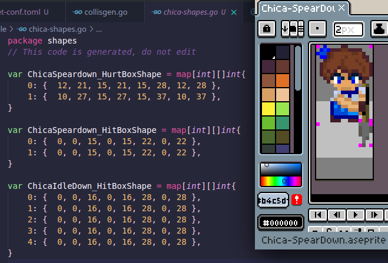

# CollisGen
A command to generate collision geometry from aseprites.

The command is designed to be used with `go generate` so to use in a go generate pipline: `go install github.com/Racinettee/collisgen@latest`

For a quick example `clone` this repo, `cd` into example and `go run ../collisgen.go -c` this will generate a new file called `chica-shapes.go`

To use:

1. create a sprite in aseprite with a layer name of either `<HitBox>` or `<HurtBox>` or both.
2. in the frames place magenta pixels `RGB(255, 0, 255)`
3. create an `asset-conf.toml` in the same directory where go source specifies a generate command. the example directory contains an example `asset-config` but in short it should specify a directory and list of files to parse for collision geometry
4. add a go generate command `//go generate collisgen -c`
5. running `go generate` will output a file containing a mapping of frames to collision geometry for each file, and special layer
6. The output arrays are meant to be compatible with the format `resolv` accepts for example.

